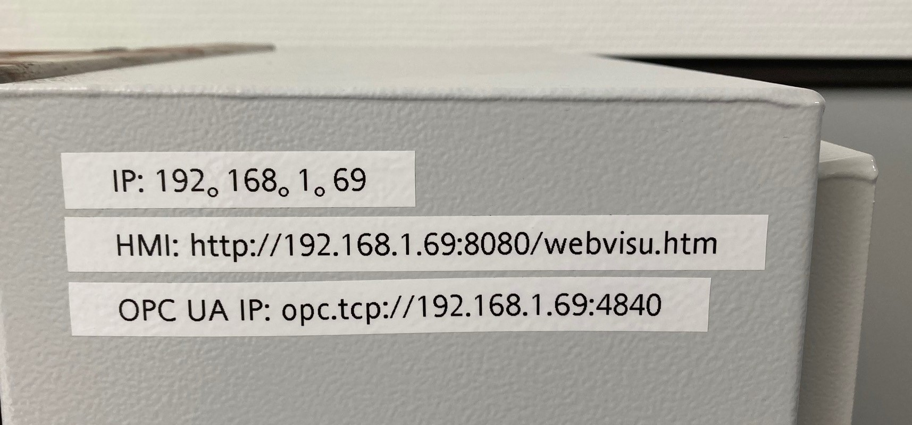
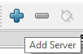
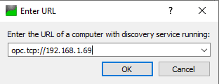
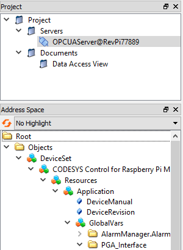

# API Documentation for PGU9500 Device via OPC UA

Rego-Fix Switzerland
Version: 1.1.2

---

The API documentation for the PGA Communication Interface of the PGU9500 device offers comprehensive guidance for integrating it into automation cells, providing control over actions and access to important information. 
It empowers users to maximize the potential of the PGU9500 device through understanding and utilizing the API commands.

---

## Table of Contents

- [1. Introduction](#introduction)
- [2. Connection Setup](#connection-setup)
- [3. Authentication and Security](#authentication-and-security)
- [4. Data Model](#data-model)
- [5. Procedures](#procedures)
- [6. Events](#events)
- [7. Error Handling](#error-handling)
- [8. Safety](#safety)
- [9. Examples and Code Snippets](#examples-and-code-snippets)
- [10. Additional Information](#additional-information)
- [11. Resources and Links](#resources-and-links)

---

## 1. Introduction 

Welcome to the API documentation for the PGA Communication Interface of the PGU9500 device. 
This documentation provides a comprehensive guide on how to interact with the PGU9500 device through the OPCUA interface, enabling seamless integration into automation cells. 
The PGA Communication Interface allows you to control various actions and retrieve important statistics, errors, maintenance information, and notifications from the PGU9500. 
Whether you're developing software, building automation systems, or troubleshooting the device, this documentation will assist you in understanding the API commands and their corresponding functionalities. 
Get ready to explore the capabilities of the PGA Communication Interface and unlock the full potential of the PGU9500 device.

//TODO Unterkapitel-> wie sind die Abläufe organisiert, wie wird angedacht das die Werkzeuge gewechselt werden.
//TODO Was für Betriebsmodus gibts es.
//TODO Wie funktioniert das Pressen generel.

---

## 2. Connection Setup 

The Connection Setup of the PGU9500 device plays a crucial role in establishing a seamless communication link between the device and external systems. This section of the API documentation provides a comprehensive overview of the steps involved in setting up a connection and how it works.
To establish a connection with the PGU9500, you need to follow a series of steps. 

First, ensure that the device is powered on and connected to the network. 
The PGU9500 supports Ethernet communication, allowing it to be integrated into various automation setups. 

Once the device is ready, you can proceed to configure the connection parameters. //TODO (Not defined yet)
The Device have a fixed IP address. These settings determine how external systems can interact with the device. 
The used protocol is OP-CUA (OPC Unified Architecture), which provides a standardized and secure method for communication.
To initiate the connection, external systems need to establish a connection request using the configured IP address and port number.  
Once the connection is established, bi-directional communication can take place.
During the connection, external systems can send commands to the PGU9500 to control its operations. 
The PGU9500 processes the commands and sends back responses, providing real-time information and notifications.
It's important to handle connection errors and timeouts gracefully. 
The documentation provides details on error handling and troubleshooting tips to ensure a robust and stable connection.
By following the Connection Setup guidelines outlined in this documentation, you'll be able to seamlessly integrate the PGU9500 device into your automation environment, enabling efficient control and monitoring capabilities.

When you get you your new PGA9500 device you the device IP address is: http://192.168.1.69
To check if the connection can be established, it is possible do ping the device.
When the ping is successful it must be possible to connect with the webbrowser (Google Chrome, Firefox, Edge) to the device. 

http://192.168.1.69:8080/webvisu.htm

If this page appears the connection to the PGA9500 was successful. 

### Change the IP address of the device
//TODO How to change the IP address on the device

### Check de connection to the OPC-UA server with OPC-UA Client
To check if a OPCUA communication can be established, an external client can be used named UA Expert.
It is available on https://www.unified-automation.com/downloads/opc-ua-clients.html

#### OPC UA Connection 

**Endpoint IP: opc.tcp://192.168.1.69**  
**Endpoint: opc.tcp://192.168.1.69:4840**

Entpoint over name:  
*Endpoint: 'opc.tcp://RevPi77889:4840'*  
*Endpoint: 'opc.tcp://RevPiXXXXX:4840'*

X is a placeholder for the serial number of the integrated PLC.
This number can be found on the front of the electrical cabinet.

#### UaExpert
UAExpert Client is a powerful software tool used for testing and troubleshooting OPC UA (Unified Architecture) servers and clients. 
This article provides a concise overview of UAExpert Client, highlighting its key features and functionalities. 
With UAExpert Client, users can easily connect to OPC UA servers, browse their address space, read and write data, and monitor server performance. 
The tool supports various security mechanisms, including user authentication and encryption, ensuring secure communication between the client and server. 
With its intuitive user interface and comprehensive set of features, UAExpert Client empowers users to efficiently validate OPC UA implementations, diagnose issues, and optimize the performance of their OPC UA systems.

##### UaExpert Server Configuration

To connect to a opc ua server, the user needs to press de plus sign and add a new server to the project. 
 
  

In the server selection window you need to double-click on the add server layer. 
There are several subsections. 
It is important to choose the customer discovery section.
 
 

In to the screen pops a window. 
There you need to enter the endpoint ip adress is given bi initialisation or this you choose by your own. 
The OPC-UA Connection can be found in the section: [OPC UA Connection](#opc-ua-connection)
 
 

When there is a OPC UA server found, below of the ip address pops of a server icon with the server name and ip address. 
When this doesn't pops on there could be a problem with the connection of to the device. 
Check the network adaptor configurations and have a look in the [Troubleshoot](#troubleshoot) section.
Press OK to continue.
 
 

In the project there is now added a connection to the opc server.
Normaly the connection establish by itself, when it not connects by itself press de connection button.
 
 

When everything works fine, the connection is establish and you can see the same sturcture like in the picture below. 
You can see the close connector in the Project section.
In addition, you can expand the folder Root like below to the subfolder PGA_Interface.
In this Folder are all Variables to control the PGA device over a Network connection.
 
 

##### UaExpert Hierachy

To visualize the Date the variables can drag and drop to the middle section of the window.
##### UaExpert Example Data

Over the variable view the variables can be manipulated and tested out. 
In the Statuscode raw the connectionstate be readed.
Variables can be set by clicking on it and change some values. 
Integers have numbers to change and enter, while booleans have a checkbox to set or unset.

---

## 3. Authentication and Security 

The Authentication and Security chapter focuses on the crucial aspects of data protection and user authentication within the context of the PGU9500 device. 
Currently, our system does not employ encrypted data transmission or implement login and user authentication mechanisms.
In a further project state it can be possible (if recommended) to implement a communication over user authentication or communication with encryption with RSA over certificates.
Please note that while this documentation does not provide specific instructions for implementing these security measures, it is highly recommended to consult relevant security resources and professionals to ensure the appropriate implementation based on your specific requirements and industry best practices.

---

## 4. Data Model 
The Data Model is a foundational concept in database management that defines how data is organized, structured, and related within a system. It serves as a blueprint for data storage and manipulation, enabling efficient data retrieval and manipulation operations.

### Communication API
1: PGA State 
2: PGA Response 
3: Interaction Commands 
4: Command 1 
5: Command 2 

#### Variable Structures
|  | PGA State (1)  | PGA Response (2)   | Interaction Commands (3) | Command (4)          | Command (5)           |
|--|:---------------|:-------------------|:-------------------------|:---------------------|:----------------------|
| 0 | is Enabled     | Ready for Commands | Enable Device            | Press In             | Mode Change           |  
| 1 | Maintenance    | Command recieved   | Execute (Command 4 & 5)  | Press Out            | Mode Change with Door |
| 2 | Error          | At working         |                          |                      | Mode Change to In     |
| 3 | Safety         | Door is Closed     | spaceFree                | 	                    | Mode Change to Out    |
| 4 | Notifications  | Workpiece in PGA   | Reset                    | Press In Complete    | Door Close            |
| 5 | Press In Mode  | Paused             | Pause                    | Press Out Complete   | Door Open             |
| 6 | Press Out Mode | command rejected   | ack                      | Press In InComplete  | Bolt Close            |
| 7 |                | Command Finished   | shutdown                 | Press Out Incomplete | Bolt Open             |

##### Permissions:

| id | Desciption   |
|----|--------------|
| r  | read         |
| w  | write        |
| rw | read + write |

#### Variable List

| Variablename       | Datatype         | Permissions | OPC UA Connection String                                                                                |
|:-------------------|------------------|-------------|:--------------------------------------------------------------------------------------------------------|
| isEnable           | Bool             | r           | NS4\|String\|\|var\|CODESYS Control for Raspberry Pi MC SL.Application.PGA_Interface.isEnabled          |
| maintenance        | Bool             | r           | NS4\|String\|\|var\|CODESYS Control for Raspberry Pi MC SL.Application.PGA_Interface.maintenance        |
| error              | Bool             | r           | NS4\|String\|\|var\|CODESYS Control for Raspberry Pi MC SL.Application.PGA_Interface.error              |
| safety             | Bool             | r           | NS4\|String\|\|var\|CODESYS Control for Raspberry Pi MC SL.Application.PGA_Interface.safety             |
| notifications      | Bool             | r           | NS4\|String\|\|var\|CODESYS Control for Raspberry Pi MC SL.Application.PGA_Interface.notifications      |
| pressInMode        | Bool             | r           | NS4\|String\|\|var\|CODESYS Control for Raspberry Pi MC SL.Application.PGA_Interface.pressInMode        |
| pressOutMode       | Bool             | r           | NS4\|String\|\|var\|CODESYS Control for Raspberry Pi MC SL.Application.PGA_Interface.pressOutMode       |
| readyForCommands   | Bool             | r           | NS4\|String\|\|var\|CODESYS Control for Raspberry Pi MC SL.Application.PGA_Interface.readyForCommands   |
| commandRecieved    | Bool             |r            | NS4\|String\|\|var\|CODESYS Control for Raspberry Pi MC SL.Application.PGA_Interface.commandRecieved    |
| atWorking          | Bool             | r           | NS4\|String\|\|var\|CODESYS Control for Raspberry Pi MC SL.Application.PGA_Interface.atWorking          |
| doorIsClosed       | Bool             | r           | NS4\|String\|\|var\|CODESYS Control for Raspberry Pi MC SL.Application.PGA_Interface.doorIsClosed       |
| workpieceInPGA     | Bool             | r           | NS4\|String\|\|var\|CODESYS Control for Raspberry Pi MC SL.Application.PGA_Interface.workpieceInPGA     |
| paused             | Bool             | r           | NS4\|String\|\|var\|CODESYS Control for Raspberry Pi MC SL.Application.PGA_Interface.paused             |
| commandRejected    | Bool             | r           | NS4\|String\|\|var\|CODESYS Control for Raspberry Pi MC SL.Application.PGA_Interface.commandRejected    |
| commandFinished    | Bool             | r           | NS4\|String\|\|var\|CODESYS Control for Raspberry Pi MC SL.Application.PGA_Interface.commandFinished    |
| enableDevice       | Bool             | w           | NS4\|String\|\|var\|CODESYS Control for Raspberry Pi MC SL.Application.PGA_Interface.enableDevice       |
| execute            | Bool             | w           | NS4\|String\|\|var\|CODESYS Control for Raspberry Pi MC SL.Application.PGA_Interface.execute            |
| spaceFree          | Bool             | w           | NS4\|String\|\|var\|CODESYS Control for Raspberry Pi MC SL.Application.PGA_Interface.spaceFree          |
| reset              | Bool             | w           | NS4\|String\|\|var\|CODESYS Control for Raspberry Pi MC SL.Application.PGA_Interface.reset              |
| pause              | Bool             | w           | NS4\|String\|\|var\|CODESYS Control for Raspberry Pi MC SL.Application.PGA_Interface.pause              |
| ack                | Bool             | w           | NS4\|String\|\|var\|CODESYS Control for Raspberry Pi MC SL.Application.PGA_Interface.ack                |
| shutdown           | Bool             | w           | NS4\|String\|\|var\|CODESYS Control for Raspberry Pi MC SL.Application.PGA_Interface.shutdown           |
| pressIn            | Bool             | w           | NS4\|String\|\|var\|CODESYS Control for Raspberry Pi MC SL.Application.PGA_Interface.pressIn            |
| pressOut           | Bool             | w           | NS4\|String\|\|var\|CODESYS Control for Raspberry Pi MC SL.Application.PGA_Interface.pressOut           |
| pressInComplete    | Bool             | w           | NS4\|String\|\|var\|CODESYS Control for Raspberry Pi MC SL.Application.PGA_Interface.pressInComplete    |
| pressOutComplete   | Bool             | w           | NS4\|String\|\|var\|CODESYS Control for Raspberry Pi MC SL.Application.PGA_Interface.pressOutComplete   |
| pressInIncomplete  | Bool             | w           | NS4\|String\|\|var\|CODESYS Control for Raspberry Pi MC SL.Application.PGA_Interface.pressInIncomplete  |
| pressOutIncomplete | Bool             | w           | NS4\|String\|\|var\|CODESYS Control for Raspberry Pi MC SL.Application.PGA_Interface.pressOutIncomplete |
| doorClose          | Bool             | w           | NS4\|String\|\|var\|CODESYS Control for Raspberry Pi MC SL.Application.PGA_Interface.doorClose          |
| doorOpen           | Bool             | w           | NS4\|String\|\|var\|CODESYS Control for Raspberry Pi MC SL.Application.PGA_Interface.doorOpen           |
| boltClose          | Bool             | w           | NS4\|String\|\|var\|CODESYS Control for Raspberry Pi MC SL.Application.PGA_Interface.boltClose          |
| boltOpen           | Bool             | w           | NS4\|String\|\|var\|CODESYS Control for Raspberry Pi MC SL.Application.PGA_Interface.boltOpen           |
| modeChange         | Bool             | w           | NS4\|String\|\|var\|CODESYS Control for Raspberry Pi MC SL.Application.PGA_Interface.modeChange         |
| modeChangeWithDoor | Bool             | w           | NS4\|String\|\|var\|CODESYS Control for Raspberry Pi MC SL.Application.PGA_Interface.modeChangeWithDoor |
| modeChangeToIn     | Bool             | w           | NS4\|String\|\|var\|CODESYS Control for Raspberry Pi MC SL.Application.PGA_Interface.modeChangeToIn     |
| modeChangeToOut    | Bool             | w           | NS4\|String\|\|var\|CODESYS Control for Raspberry Pi MC SL.Application.PGA_Interface.modeChangeToOut    |
| errorMessages      | Unsigned Integer | r           | NS4\|String\|\|var\|CODESYS Control for Raspberry Pi MC SL.Application.PGA_Interface.errorMessages      |
| warningMessages    | Unsigned Integer | r           | NS4\|String\|\|var\|CODESYS Control for Raspberry Pi MC SL.Application.PGA_Interface.warningMessages    |
| alarmAckMessages  | Unsigned Integer | r           | NS4\|String\|\|var\|CODESYS Control for Raspberry Pi MC SL.Application.PGA_Interface.alarmAckMessages   |

#### Description of the Variables
##### Is Enabled
This Bool is used to check if the PGA is enabled. If the PGA is enabled the PGA will respond with False. If the PGA is not enabled the PGA will respond with True.
##### Maintenance
This Bool is used to check if the PGA is in Maintenance. If the PGA is in Maintenance the PGA will respond with True. If the PGA is not in Maintenance the PGA will respond with False.
##### Error
This Bool is used to check if the PGA is in Error. If the PGA is in Error the PGA will respond with True. If the PGA is not in Error the PGA will respond with False.
##### Safety
This Bool is used to check if the PGA Safetysystem is closed or open. If the PGA is Safe, the PGA will respond with True. If the PGA is not in Safety the PGA will respond with False.
##### Notifications
This Bool is used to check if the PGA hase some Notifications. If the PGA has some Notifications the PGA will respond with True. If the PGA haven't some Notifications the PGA will respond with False.
##### 
##### 
##### 

##### Ready for Commands
This Bool is used to check if the PGA is ready for Commands. If the PGA is ready for Commands the PGA will respond with True. If the PGA is not ready for Commands the PGA will respond with False.
##### Command recieved
This Bool is used to check if the PGA has recieved a Command. If the PGA has recieved a Command the PGA will respond with True. If the PGA has not recieved a Command the PGA will respond with False.
##### At working
This Bool is used to check if the PGA is at working. If the PGA is at working the PGA will respond with True. If the PGA is not at working the PGA will respond with False.
##### Door is Closed
This Bool is used to check if the PGA Door is closed. If the PGA Door is closed the PGA will respond with True. If the PGA Door is not closed the PGA will respond with False.
##### Workpiece in PGA
This Bool is used to check if the PGA has a Workpiece in it. If the PGA has a Workpiece in it the PGA will respond with True. If the PGA has not a Workpiece the PGA will respond with False.
##### Paused
This Bool is used to check if the PGA was Paused. If the PGA is in Paused the PGA will respond with True. If the PGA is not in Paused the PGA will respond with False.
##### Command rejected
This Bool is used to check if the PGA rejected a command. If the PGA will respond with True a command was rejected. The True state is one second active and goes back to false. If the PGA will respond with False every thing is ok.
##### Command Finished
This Bool is used to check if the PGA has finished a Command. If the PGA has Command Finished, the PGA will respond with True, the state stays für one second active and goes back to false. . If the PGA respond with False the process is not finished yet.

##### Enable Device
This Bool is used to enable the PGA. If the PGA is enabled the PGA will respond with True. If the PGA is not enabled the PGA will respond with False.
##### Execute Command 4 & 5
This Bool is used to execute a command. If the PGA has executed a command the PGA will respond with True. If the PGA has not executed a command the PGA will respond with False.
####
#### Space Free
This Bool is used to check if the PGA Door and Bolt can be moved. When this Boolean is not Activated, the Door doesn't move and alle command will pause.
#### Reset
This Bool is used to reset the PGA. All States and Erros / Warnings will be reseted. 
#### Pause
This Bool is used to pause the PGA. If the PGA is paused the PGA will respond with the variabled paused with True. If the PGA is not paused the PGA will respond with False.
##### Ack
If the device had a fance open error, the PGA must be reactivated by the Acknowledge Bool ack or over the HMI-Interface.
##### Shutdown
This Bool is used to shutdown the PGA. If the PGA is shutdown the PGA. After send this command the PGA can not give any response.

##### Press In
This Bool is used to press in a workpiece. This Boolean is only to activate the Press In Command. To start the Press in cylce the Execute Bool must be set to True. If the PGA has pressed in a workpiece the PGA will respond with True. If the PGA is finished with pressing in a callet the PGA will respond on the commandComplete Bool with True. If the PGA has not pressed in a workpiece the PGA will respond with False. 
##### Press Out
This Bool is used to press out a workpiece. This Boolean is only to activate the Press Out Command. To start the Press out cylce the Execute Bool must be set to True. If the PGA has pressed out a workpiece the PGA will respond with True. If the PGA is finished with pressing out a callet the PGA will respond on the commandComplete Bool with True. If the PGA has not pressed out a workpiece the PGA will respond with False.
##### 
##### 
##### Press In Complete
This Bool is user to press in a callet complete. In this precess the door closes by it self, press in the callet and open the door. This Boolean is only to activate the Press In Complete Command. To start the Press in Complete cylce the Execute Bool must be set to True. If the PGA has pressed in a workpiece the PGA will respond with True. If the PGA is finished with pressing in a callet the PGA will respond on the commandComplete Bool with True. If the PGA has not pressed in a workpiece the PGA will respond with False.
##### Press Out Complete
This Bool is user to press out a callet complete. In this precess the door closes by it self, press out the callet and open the door. This Boolean is only to activate the Press Out Complete Command. To start the Press out Complete cylce the Execute Bool must be set to True. If the PGA has pressed out a workpiece the PGA will respond with True. If the PGA is finished with pressing out a callet the PGA will respond on the commandComplete Bool with True. If the PGA has not pressed out a workpiece the PGA will respond with False.
##### Press In InComplete
This Bool is user to press in a callet incomplete. In this precess the door closes by it self, press in the callet and not open the door by itself. This Boolean is only to activate the Press In InComplete Command. To start the Press in InComplete cylce the Execute Bool must be set to True. If the PGA has pressed in a workpiece the PGA will respond with True. If the PGA is finished with pressing in a callet the PGA will respond on the commandComplete Bool with True. If the PGA has not pressed in a workpiece the PGA will respond with False.
##### Press Out Incomplete
This Bool is user to press out a callet incomplete. In this precess the door closes by it self, press out the callet and not open the door by itself. This Boolean is only to activate the Press Out Incomplete Command. To start the Press out Incomplete cylce the Execute Bool must be set to True. If the PGA has pressed out a workpiece the PGA will respond with True. If the PGA is finished with pressing out a callet the PGA will respond on the commandComplete Bool with True. If the PGA has not pressed out a workpiece the PGA will respond with False.

##### Mode Change
With this Bool the Mode of the PGA can be changed to the opposite Mode. This Boolean is only to activate the Mode Change Command. To start the Mode Change cylce the Execute Bool must be set to True. If the PGA has changed the Mode the PGA will respond with True. If the PGA is finished with changing the Mode the PGA will respond on the commandComplete Bool with True. If the PGA has not changed the Mode the PGA will respond with False.
##### Mode Change with Door
With this Bool the Mode of the PGA can be change to the opposite Mode and the Door will be closed while the process. This Boolean is only to activate the Mode Change with Door Command. To start the Mode Change with Door cylce the Execute Bool must be set to True. If the PGA has changed the Mode the PGA will respond with True. If the PGA is finished with changing the Mode the PGA will respond on the commandComplete Bool with True. If the PGA has not changed the Mode the PGA will respond with False.
##### Mode Change to In
With this Bool the Mode of the PGA can be change to the In Mode. This Boolean is only to activate the Mode Change to In Command. To start the Mode Change to In cylce the Execute Bool must be set to True. If the PGA has changed the Mode the PGA will respond with True. If the PGA is finished with changing the Mode the PGA will respond on the commandComplete Bool with True. If the PGA has not changed the Mode the PGA will respond with False.
##### Mode Change to Out
With this Bool the Mode of the PGA can be change to the Out Mode. This Boolean is only to activate the Mode Change to Out Command. To start the Mode Change to Out cylce the Execute Bool must be set to True. If the PGA has changed the Mode the PGA will respond with True. If the PGA is finished with changing the Mode the PGA will respond on the commandComplete Bool with True. If the PGA has not changed the Mode the PGA will respond with False.
##### Door Close
With this Bool the Door of the PGA can be closed. This Boolean is only to activate the Door Close Command. To start the Door Close cylce the Execute Bool must be set to True. If the PGA has closed the Door the PGA will respond with True. If the PGA is finished with closing the Door the PGA will respond on the commandComplete Bool with True. If the PGA has not closed the Door the PGA will respond with False.
##### Door Open
With this Bool the Door of the PGA can be opened. This Boolean is only to activate the Door Open Command. To start the Door Open cylce the Execute Bool must be set to True. If the PGA has opened the Door the PGA will respond with True. If the PGA is finished with opening the Door the PGA will respond on the commandComplete Bool with True. If the PGA has not opened the Door the PGA will respond with False.
##### Bolt Close
With this Bool the Bolt of the PGA can be closed. This Boolean is only to activate the Bolt Close Command. To start the Bolt Close cylce the Execute Bool must be set to True. If the PGA has closed the Bolt the PGA will respond with True. If the PGA is finished with closing the Bolt the PGA will respond on the commandComplete Bool with True. If the PGA has not closed the Bolt the PGA will respond with False.
##### Bolt Open
With this Bool the Bolt of the PGA can be opened. This Boolean is only to activate the Bolt Open Command. To start the Bolt Open cylce the Execute Bool must be set to True. If the PGA has opened the Bolt the PGA will respond with True. If the PGA is finished with opening the Bolt the PGA will respond on the commandComplete Bool with True. If the PGA has not opened the Bolt the PGA will respond with False.

---

## 5. Procedures 

In this chapter, we will explore the procedures of the PGA9500 device over a network interface. 
The PGA9500 offers various capabilities and functionalities that can be accessed and controlled through an API. 
This section provides a comprehensive overview of the procedures involved in enabling and disabling the PGA over the network, retrieving its state, sending commands, handling errors, changing operating modes, managing workpieces with a robot, and controlling the PGA in a detailed manner. 
Each procedure is accompanied by diagrams and explanations to facilitate a clear understanding of the API functionality. 
By following this documentation, users will be able to effectively interact with the PGA9500 device and utilize its features for their intended applications.

Continuing from the previous introduction, let's explore how the PGA9500 device interacts with the API through read and write Boolean variables.
When working with the PGA9500 device, users can access various read Boolean variables to retrieve specific status information. These variables act as indicators that provide data related to the device's state. 
For example, users can query the operational mode read Boolean variable to determine the current mode in which the PGA9500 is operating. 
Other read variables may include configuration settings, sensor readings, or diagnostic information. 
By accessing these read Boolean variables and retrieving their values, users can gain valuable insights into the device's status and make informed decisions based on the received information.
To initiate actions or modify settings on the PGA9500 device, users employ write Boolean variables. 
Before executing a command, users need to select the corresponding command Boolean variable that represents the desired action. 
This selection specifies the operation to be performed on the device. 
Once the command Boolean is set, users trigger the execute Boolean variable, which initiates the execution of the command. 
This two-step process ensures that commands are intentionally initiated and helps prevent accidental actions.
During the execution of a process, the PGA9500 device provides feedback on the status of the operation. 
This feedback is typically reflected in other Boolean variables, allowing users to monitor the progress of their actions. 
For example, a start Boolean variable may indicate that a process has begun, while a success Boolean variable may confirm that the process was completed successfully. 
Similarly, if a process fails, an error Boolean variable may be set to indicate the failure. 
By monitoring these status variables, users can track the progress of their operations and respond accordingly.
By understanding the interaction between read and write Boolean variables, users can effectively communicate with the PGA9500 device through the API. 
This comprehensive documentation provides detailed explanations and examples to guide users in leveraging these features. 
By utilizing the read Boolean variables, users can retrieve valuable status information from the device. 
By setting the appropriate write Boolean variables and executing commands, users can control and configure the PGA9500 device to meet their specific requirements. 
The feedback provided through other Boolean variables ensures users are aware of the status of their operations, facilitating a smooth and efficient interaction with the PGA9500 device.

Additionally, it is important to note that only one command can be active at a time when interacting with the PGA9500 device through the API. 
This means that before initiating a new command, the previous command must be completed or canceled.
By enforcing this restriction, the PGA9500 ensures that commands are executed in a controlled manner, preventing conflicting or overlapping actions. 
This design ensures the integrity of the device's operations and avoids any potential issues that may arise from concurrent command execution.
To manage the execution of commands effectively, users should carefully track the status of the ongoing commands and ensure that they are completed or canceled before initiating new ones. 
This can be achieved by monitoring the relevant Boolean variables associated with the command's execution status.
The documentation provided in this chapter includes clear explanations and illustrative diagrams for each command, enabling users to understand the sequence of actions required and the associated Boolean variables. 
By adhering to the principle of having only one active command at a time, users can effectively control the PGA9500 device and achieve the desired results without encountering conflicts or inconsistencies.
By following the guidelines and best practices outlined in the documentation, users can leverage the full potential of the PGA9500 device and ensure a smooth and reliable integration within their applications.

#### Enable PGA over Network

This article focuses on the process of enabling the PGA9500 device over a network interface, unlocking its capabilities and facilitating the execution of commands.
By following a systematic approach, users can power on the device and establish a connection, ensuring a seamless communication channel between the PGA9500 and external systems.
Once the device is ready, users can confidently send commands to control and configure the PGA9500 according to their specific requirements.
This article highlights the significance of enabling PGA over the network and explores the subsequent command execution process, shedding light on the pivotal role it plays in leveraging the device's functionality.

1. The device is powered on and ready to be enabled. The opc ua connection is established and the device is ready to receive commands. The device is in the disabled state. The device is not ready to execute commands. The enableDevice Boolean variable is set to false and will be set to true to enable the device.
2. After setting the enableDevice Boolean variable to true, the device will start the enabling process. The device will start the enabling process and will set the isEnabled Boolean variable to true. This indicates that the device is enabled and the initialisation process is finished.
3. In addition to the isEnable variable the device will also set the readyForCommands Boolean variable to true. This indicates that the device is ready to receive commands. The device is now ready to receive commands and execute them.
4. The Device is now in the enabled and ready state. When this is done by the first time, the device is initialized in the "press In" mode and the "press In" mode is set to true. The device is now ready to receive commands and execute them.

#### Disable PGA over Network

This article focuses on the process of disabling the PGA9500 device over a network interface, ensuring the safe disconnection and termination of device functionalities. 
By following a systematic approach, users can initiate the disabling procedure, effectively halting command execution and severing the connection between the PGA9500 and external systems. 
This article highlights the significance of disabling PGA over the network and explores the subsequent implications, emphasizing the importance of proper device shutdown and the prevention of unintended operations.

1. The device is enabled and ready to be disabled. The opc ua connection is established and the device is ready to receive commands. The device is in the enabled state. The device is ready to execute commands. The enableDevice Boolean variable is set to true and will be set to false to disable the device.
2. After setting the enableDevice Boolean variable to false, the device will start the disabling process. The device will start the disabling process and will set the isEnabled Boolean variable to false. This indicates that the device is disabled and the initialisation process is finished.
3. In addition to the isEnable variable the device will also set the readyForCommands Boolean variable to false. This indicates that the device is not ready to receive commands. The device is now not ready to receive commands and execute them.
4. When something is wrong in the disabling process, the device will also set the error Boolean variable to true. This indicates that the device is in an error state and the initialisation process is finished. There could also appear while the device where disabling while a process is in progress. The exact error message can be found in the errorString variable.
5. The Device is now in the disabled and not ready state. When this is done by the first time, the device is initialized in the "press In" mode and the "press In" mode is set to true. The device is now ready to receive commands and execute them.

#### Get State of PGA over Network

This part provides a comprehensive guide on how to retrieve the state information of the PGA9500 device over a network interface. 
It highlights the various status indicators that can be read from the device, including maintenance status, safety information, error conditions, press-in and press-out mode, door state, bolt state, and workpiece presence within the device. 
By following the instructions outlined in this guide, users can effectively access and interpret these status parameters, enabling them to monitor the device's condition, ensure safety compliance, and make informed decisions regarding maintenance, process control, and workpiece handling. 
Understanding the state of the PGA9500 device empowers users to optimize its operation and maximize efficiency in their specific applications.

1. All state can be read at every state or time the device is online and powered on. The opc ua connection is established. The device has not to be enabled to read the state. The device is in the disabled state. The device is not ready to execute commands. The enableDevice Boolean variable is set to false and will be set to true to enable the device. 
2. The maintenence boolean indicate with a positive true, that the device have a maintenance issue, that should be eliminated. That could be a oil refill or a seal that have to be changed. The exact maintenance message can be read in the maintenanceString variable.
3. The safety boolean is true when the safety circuit is closed. This means that the external door circuit is closed and no emergency stop is pressed. That can circuit can be open without an error message.
4. The error boolean is true when the device is in an error state. The exact error message can be read in the errorString variable.
5. The pressOutMode boolean indicates the mode of the device. When the boolean is true, the device is in the press out mode. When the boolean is false, the device is in the press in mode. When the pressInMode boolean is true, the device is in the press in mode and the pressOutMode boolean is false.
6. The doorClose boolean indicates the state of the door. When the boolean is true, the door is closed. When the boolean is false, the door is open and the boolean doorIsOpen is true. The same but invertet applies for the doorIsOpen boolean. The same applies for the boltClose and boltIsOpen boolean. 
7. A special indicator is the workpiceInPGA boolean. That indicates when a workpiece is in the PGA. That could be helpful to prevent collisions after a reset oder initalisation. When the variable is true, a workpiece is in the PGA. When the variable is false, no workpiece is in the PGA and the space is free.

#### Commands to PGA over Network

This comprehensive guide outlines the process of communicating with the PGA9500 device over a network interface using variables. 
It provides a detailed explanation of the step-by-step sequence required to send commands effectively, covering optional elements in the process. 
The guide encompasses 11 essential steps, including selecting a command boolean, executing the command, and receiving confirmation. 
By following these instructions, users can navigate the communication process seamlessly, ensuring accurate command transmission and facilitating efficient control of the PGA9500 device. 
Understanding the command structure and adhering to the prescribed sequence empowers users to interact with the PGA9500 effectively, unlocking its capabilities for a wide range of applications.

1. Before a command can be executed or set, the device have to be enabled like described in the enable section. The opc ua connection is established and the device is ready to receive commands. Important is that the isWorking variable is on false and the readyForCommands variable is on true. 
2. When the preconditions are fulfill, any command can be set. The commands can be like in the picture above pressInComplete to true. There could only be set one command at the same time. When there are more than one command set, the device can not manage them and rise an error. So it is important to set only one command at the same time. The list of the commands are in the table above in the command section.
3. When one command is selected, the execute variable can be set to true. This will execute the command. 
4. After that command is executed, the PGA register that command and when everything is fine to execute, the commandRecieved value is set to true. That indicates that the PGA accept the command and will execute it. Additionally the variable readyForCommands is set to false. That indicates that the PGA is not ready to receive commands. 
5. With the atWorking variable the PGA indicates that the PGA is in process and works at a command that is set. 
6. After 1-2 seconds the commandRecieved variable is set to true, the PGA turns the commandRecieved variable to false. That is for only for reseting the state of the commandRecieved variable.
7. While the command is executing and the commandRecieved variable has been confirms that the command is working, it is possible to set the command to false.
8. The same applies for the execute variable.
9. When the PGA is finished with the given command, the isWorking variable is set to false and indicates that the PGA is no more working at a command.
10. An additional indicator is the commandFinished variable. When this variables turns to true the command is safely and correct finished. The process is done and has no errors or issues. This variable changes back to false after a few seconds
11. When everything works fine, the readyForCommands variable is set to true and the PGA is ready to receive commands again. The command has an successfull work and the PGA is ready for the next command. When some errors apper while executing a command the PGA indicates this with the error variable and a text at the errorString variable.

#### Error Handling PGA over Network
//TODO make better illustration
// TODO describe
//TODO definieren und ausdenken......

#### Mode Change PGA over Network

This article explores the mode change functionality of the PGA9500 device over a network interface. 
The focus is on the two available modes: Press In Mode and Press Out Mode. Users can switch between these modes by employing a similar command structure as described in the previous chapters. 
Three different methods for mode switching are discussed: 
1) transitioning directly to the other mode,
2) transitioning to a specific mode (e.g., Press In Mode), and 
3) transitioning to a specific mode while also closing the door. 

By following the instructions provided, users can seamlessly change modes and adapt the PGA9500 device to their specific operational requirements. 
Understanding the mode change process enables efficient utilization of the PGA9500 device's capabilities, enhancing overall productivity and flexibility. 
This article serves as a comprehensive guide to successfully navigate the mode change procedure for optimal control and performance of the PGA9500 device.

1. Before a mode change can be executed or set, the device have to be enabled like described in the enable section. The opc ua connection is established and the device is ready to receive commands. Important is that the isWorking variable is on false and the readyForCommands variable is on true.
2. When the preconditions are fulfill, any mode change can be set. The mode changes can be like in the picture above pressInMode to true. There could only be set one mode change at the same time. When there are more than one mode change set, the device can not manage them and rise an error. So it is important to set only one mode change at the same time. The list of the mode changes are in the table above in the mode change section.
3. When one mode change is selected, the execute variable can be set to true. This will execute the mode change.
4. After that mode change is executed, the PGA register that mode change and when everything is fine to execute, the modeChangeRecieved value is set to true. That indicates that the PGA accept the mode change and will execute it. Additionally the variable readyForCommands is set to false. That indicates that the PGA is not ready to receive commands.
5. With the atWorking variable the PGA indicates that the PGA is in process and works at a mode change that is set.
6. After 1-2 seconds the modeChangeRecieved variable is set to true, the PGA turns the modeChangeRecieved variable to false. That is for only for reseting the state of the modeChangeRecieved variable.
7. While the mode change is executing and the modeChangeRecieved variable has been confirms that the mode change is working, it is possible to set the mode change to false.
8. The same applies for the execute variable.
9. When the PGA is finished with the given mode change, the isWorking variable is set to false and indicates that the PGA is no more working at a mode change.
10. An additional indicator is the modeChangeFinished variable. When this variables turns to true the mode change is safely and correct finished. The process is done and has no errors or issues. This variable changes back to false after a few seconds
11. When everything works fine, the readyForCommands variable is set to true and the PGA is ready to receive mode changes again. The mode change has an successfull work and the PGA is ready for the next mode change. When some errors apper while executing a mode change the PGA indicates this with the error variable and a text at the errorString variable.

#### Control PGA Detailed over Network

To initiate the process, an external device, such as a robot or a linear axis system, starts by inserting a PG holder into the PGA9500. 
The PG holder contains the necessary tool and gripper for the intended operation. 
Once the holder is securely placed, the door of the PGA9500 is closed, signaling the device to proceed with the subsequent steps.
Upon detecting the closed door, the PGA9500 allows the robot to release its grip on the toolholder. 
During this phase, the automation system no longer needs to actively hold the toolholder, as the PGA9500 takes over the responsibility of securing it in place.
Before the door reopens, the external automation system must regain control and ensure the toolholder is firmly held. 
This step is essential to maintain stability and prevent any unwanted movement or dislodging of the tool during the subsequent operation.
With the external system holding the tool holder, the door of the PGA9500 opens, granting access to the inserted tool. 
The open door allows the robot to safely extract the pressed-in tool from the PGA9500. 
Care should be taken to ensure proper alignment and secure handling during this step to avoid any damage to the tool or the device.
Once the extraction process is completed, the extracted tool is now available for reuse in subsequent operations. 
The PGA9500 is now ready for the next tool insertion or extraction cycle.
It is important to note that this process cycle is applicable to PG holders of all sizes, and it applies to both tool insertion and extraction operations. 
The synchronized coordination between the PGA9500 device and the external automation system ensures efficient and reliable tool handling throughout the operation.

1. The PG toolholter is inserted into the PGA9500 and the PGA is enabled and ready to recieve any commands. The door can be closed.
2. The PGA9500 can start with the press procedure. It is the same procedure for the press in or for the press out mode.
3. When the press procedure is finished, the PGA9500 indicates that the press procedure is finished and the door can be opened. Then the door can be opened by him self or over network (pressXComplete, pressXInComplete). For the automation system around the PGA9500 it is important to hold the PG toolholder otherwise the PG toolholder will fall out of the PGA9500.
4. When the prcedure is finshed the robot can interact with the other storage- or handling-systems and the PGA9500 is ready for the next press procedure.

#### Change Workpiece with Robot Feedback

One of the remarkable features of the PGA9500 device is its ability to provide real-time feedback on the status of the inserted tool. 
This ensures effective monitoring and enables users to stay informed about the presence or absence of a tool within the PGA9500. 
To initiate the tool status monitoring process, a robot is utilized to insert a tool into the PGA9500. 
The device is equipped with a sensor that actively detects the presence of the tool.
As the robot places the tool into the PGA9500, the sensor feedback becomes active, indicating that the tool is securely inserted and ready for operation. 
Once the tool is inserted, the sensor feedback remains active, providing continuous monitoring of the tool's presence within the PGA9500. 
This real-time status information can be accessed through the API, allowing users to retrieve the tool status as needed.
When the robot removes the tool from the PGA9500, the sensor feedback is deactivated, indicating that the tool is no longer present in the device. 
This change in status can be monitored through the API, providing prompt updates to the external automation system.

1. The device is enabled and ready to recieve any commands. In the device is a tool-holder placed and the process of pressing in or out is completed.
2. The doorIsClosed is on false, that means that the door is open the robot can interact with the PGA9500. In addition the spaceFree Variable has to be true, that means that the space is free and the robot can place a new tool-holder in the PGA9500.
3. On the OPC UA interface is the workpieceInPga true, because a tool-holder is in the PGA9500 and can be gripped by the robot.
4. When the space is free the robot can grab the tool-holder and can move with a linear line interpolation out of the PGA9500.
5. When the tool-holder is removed from the PGA9500 the workpieceInPga turn to false and sign that no workpiece is in the device.
6. The robot can change the worpiece and place a new toolholder in to the PGA9500
7. As soon as the workpiece is laid back in the PGA9500 the variable turns back to true and sign that a device can interact with the tool-holder.
8. The device is ready to recieve new commands and start any process with this tool-holder. Remember, the robot can only let the tool-holder go, when the PGA9500 closed the door.

#### Example when a Commands was rejected by PGA over Network
//TODO <picture of a bad Example>
// TODO describe

#### Example when PGA Device is in wrong State over Network
//TODO <picture of a bad Example>
// TODO describe

---

## 6. Events 

---

## 7. Error Handling 

### Error Codes

| Error Code | Name                                                                                   | Description | Solution                                                                                                           |
|------------|----------------------------------------------------------------------------------------|-------------|--------------------------------------------------------------------------------------------------------------------|
|            | No Error                                                                               | No Error | No Error                                                                                                           |
| 0          | Door can not be closed                                                                 | Door Close timeout error | There must be an Error with the Engine or the Energie supply. There could also  be something between Door and PGA. |
| 1          | Door can not be opened                                                                 | Door Open timeout error | There must be an Error with the Engine or the Energie supply. There could also  be something between Door and PGA. |
| 2          | An unknown command was used or the command was misspelled                              | The command was not recognized by the PGA9500. | Check the command and try again.                                                                                   |
| 3          | There is a error in the booting phase                                                  | The PGA9500 is not ready to recieve any commands. | Check the device and try again.                                                                                    |
| 4          | The mode can not be changed                                                            | The mode can not be changed. | Check the device and try again.                                                                                    |
| 5          | The Niveau of the Oil is to low                                                        | The Niveau of the Oil is to low. | Refill the Oil.                                                                                                    |
| 6          | The Temperature of the Oil is to higth                                                 | The Temperature of the Oil is to higth. | Wait until the Oil is cooled down.                                                                                 |
| 7          | The PGA can not press in.                                                              | The PGA can not press in. | Check the device and try again.                                                                                    |
| 8          | The PGA can not press out.                                                             | The PGA can not press out. | Check the device and try again.                                                                                    |
| 9          | The safety circuit is open                                                             | The safety circuit is open. | Close the Safety circuit                                                                                           |
| 10         | All undefined Errors will be collected here                                            | All undefined Errors will be collected here. | Check the device and try again.                                                                                    |
| 11         | More Information about the VFD you can read from the display on it.  VFD has an Error. | More Information about the VFD you can read from the display on it.  | Check the device and try again.                                                                                    |
| 12         | The PGA is in the wrong Mode.                                                          | The PGA is in the wrong Mode. | Change PGA Mode                                                                                                    |
| 13         | Bolt can not be closed                                                                 | Bolt Close timeout error | There must be an Error with the Engine or the Energie supply. There could also be something between Bolt and PGA   |
| 14         | Bolt can not be opened                                                                 | Bolt Open timeout error | There must be an Error with the Engine or the Energie supply. There could also be something between Bolt and PGA   |

### Acknowlege Codes

| Acknowlege Code | Name | Description | Solution                                   |
|------------|------|-------------|--------------------------------------------|
|            | No Error | No Error | No Error                                   |
| 0          | Safety Circuit is open | The safety circuit is open. | Close the Safety circuit                   |
| 1          | More Information about the VFD you can read from the display on it.  VFD has an Error. | More Information about the VFD you can read from the display on it.  | Check the device and try again.            |

Door can not be closed. Door Close timeout error. There must be an Error with the Engine or the Energie supply. There could also  be something between Door and PGA.
### Maintenance Codes

| Maintenance Code | Name | Description                                           | Solution                                         |
|------------|------|-------------------------------------------------------|--------------------------------------------------|
|            | No Error | No Error                                              | No Error                                         |
| 0 | The Niveau of the Oil is low. Oil is to be added to the oil tank. | The Niveau of the Oil is low.                         | Refill the Oil.                                  |
|1| The Bolt have long to close /open | The Bolt have long to close /open                     | Check if the Door is Blocked or have some issues |
|2 | The Door have long to close /open | The Door have long to close /open                     | Check if the Door is Blocked or have some issues |
|3 | The Machine is in Manual Mode | The Machine is in Manual Mode                         | Switch Mode to Automatic Mode                    |
|4 | The Machine is not ready or not enabled | The Machine is not ready or not enabled               | Check if the Machine is ready and enabled        |
|5 | The Oil has to be changed | The Oil has to be changed                             | Change the Oil                                   |
|6 | The Temperature of the Oil is higth | The Temperature of the Oil is higth                   | Wait until the Oil is cooled down                |
|7 | The Oil tube has to be changed | The Oil tube has to be changed                        | Change the Oil tube                              |
|8 | The PG Systam have very long for Press In / Press Out | The PG Systam have very long for Press In / Press Out | Check the device and try again.                  |
|9 | The seals has to be changed | The seals has to be changed                           | Change the seals                                 |
|10 | Wait electricity to turn on cylinder | Wait electricity to turn on cylinder                  | Kust Wait about 20Sec after repower the Motors   |
|11 | The Filter has to be changed | The Filter for the electrocabinet has to be changed   | Change the Filter                                 |
|12 | The Grease has to be changed | The Grease has to be changed                          | Change the Grease                                 |

---

## 8. Safety 

//TODO Einfügen Bild Elektroschma Schaltschrank
//TODO Sicherungskreise Erklären und deren Funktionen
//TODO Was sind die Folgen wenn die Safety ausgelöst wird
//TODO Wie kommt man aus einem Fehler wieder heraus
//TODO Weitere Safety Informationen

---

## 9. Examples and Code Snippets 

Link to RFCH Github Page to Example Projects 

API Documentation: https://github.com/REGO-FIX/PGA-9500-API/API-PGA9500.md  
Example Projects: https://github.com/REGO-FIX/PGA-9500-API/Example  
Beckhoff: https://github.com/REGO-FIX/PGA-9500-API/Example/Beckhoff  
Codesys: https://github.com/REGO-FIX/PGA-9500-API/Example/Codesys  

---
## 10. Additional Information 

//TODO Weitere Informationen die für das PG Gerät Wichtig sein könnten
- Weis noch nicht.
- Irgendwelche Ideen? 

---

---

---

---

---

---

## 11. Resources and Links 
### Rego-Fix
https://ch.rego-fix.com  
//TODO https://ch.rego-fix.com/de/PGA9500  

### PG System
https://ch.rego-fix.com/en/products/system/powrgrip

### OPC UA 
https://opcfoundation.org/  
https://opcfoundation.org/members  
https://opcfoundation.github.io/UA-.NETStandard/  
https://github.com/OPCFoundation/UA-Java-Legacy/blob/master/examples/basic/README.md  
https://infosys.beckhoff.com/index.php?content=../content/1031/tcopcuaserver/633776523.html&id=  
https://de.codesys.com/produkte/codesys-runtime/opc-ua.html  
https://www.rockwellautomation.com/docs/en/factorytalk-optix/1-00/contents-ditamap/developing-solutions/object-examples/opc-ua-client-example.html  
https://support.industry.siemens.com/cs/document/109762770/s7-anwenderbaustein-f%C3%BCr-den-opc-ua-client-einer-simatic-s7-1500-?lc=de-de  
https://product-help.schneider-electric.com/Machine%20Expert/V1.2/de/m262prg/m262prg/OPC_UA_Server_Client_Configuration/OPC_UA_Server_Client_Configuration-1.htm?rhtocid=_0_18_0  
https://opcfoundation.org/members/view/341  
https://www.fanuc.eu/ch/de/cnc/connectivity/opc-server  
https://industrial.omron.eu/en/solutions/product-solutions/nj5-controller-with-opc-ua  

---

